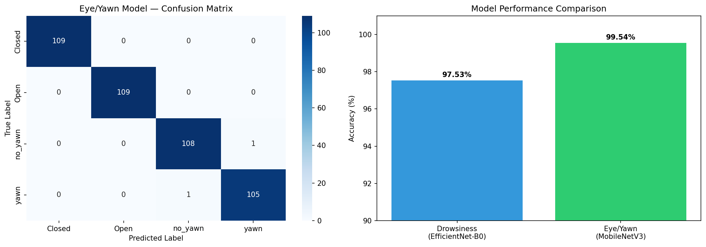

# Driver Drowsiness Detection

Real-time driver monitoring system detecting drowsiness and yawning using deep learning. Built for automotive safety applications — directly relevant to EU General Safety Regulation requiring driver monitoring in all new vehicles.

---

## Results

| Model | Task | Accuracy |
|---|---|---|
| EfficientNet-B0 | Drowsiness Detection (Active/Fatigue) | 97.53% |
| MobileNetV3 | Eye/Yawn Detection (4 classes) | 99.54% |

---

## Dataset

**Dataset 1 — Driver Drowsiness**
- 9,120 face images — 4,560 Active + 4,560 Fatigue
- Real in-car driving conditions
- Perfectly balanced classes

**Dataset 2 — Eye/Yawn Detection**
- 2,900 images across 4 classes
- Classes: Closed, Open, Yawn, No Yawn
- Train/test split provided

---

## Method

Two-stage detection pipeline:

1. **Stage 1 — Face level:** EfficientNet-B0 classifies full face as Active vs Fatigue (97.53% accuracy)
2. **Stage 2 — Feature level:** MobileNetV3 classifies eye state and yawning across 4 classes (99.54% accuracy)

Lightweight models chosen for real-time inference on automotive edge hardware.

---

## Why This Matters

EU General Safety Regulation (GSR) mandates driver monitoring systems in all new vehicles from 2024. This project demonstrates a practical deep learning approach to driver state detection that can run in real-time on embedded automotive hardware.

---

## Project Structure

- notebooks/01_eda.ipynb — EDA, training, results
- src/dataset.py — PyTorch Dataset class
- src/model.py — EfficientNet and MobileNet models
- src/train.py — Training loop
- outputs/ — Saved charts and models
- app.py — Streamlit demo

---

## Setup

pip install -r requirements.txt

Run demo:

streamlit run app.py

---

## Background

Built as part of a portfolio for Master thesis applications in automotive AI (Bosch, Continental, BMW). Extends previous experience with large-scale image classification using DenseNet121 ensemble methods.